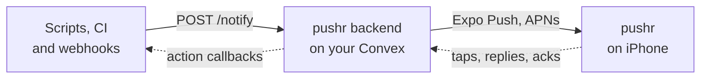

<div align="center">

<a href="https://pushr.sh">
  <picture>
    <source media="(prefers-color-scheme: dark)" srcset=".github/assets/pushr-dark.png">
    
  </picture>
</a>

<h1>pushr backend</h1>

<p><strong>Your phone, on the wire. On your own server.</strong><br>
The open-source Convex backend behind <a href="https://pushr.sh">pushr.sh</a>.<br>
Send a push to your iPhone from any script, server or bot with one HTTP request.</p>

<p>
  <a href="https://pushr.sh">Website</a> ·
  <a href="https://pushr.sh/docs">Docs</a> ·
  <a href="./API.md">API reference</a> ·
  <a href="https://pushr.sh/changelog">Changelog</a> ·
  <a href="https://pushr.sh/support">Support</a>
</p>

<p>
  
  
  
  
  
</p>

</div>

---

```bash
curl -X POST "$PUSHR_URL/notify" \
  -H "Authorization: Bearer $PUSHR_TOKEN" \
  -d '{"title":"Deploy succeeded","body":"main → production · 1m 04s"}'
```

That's the whole integration. Run this backend on your own Convex deployment, point the pushr iPhone app at
it, and every push lands in one calm feed, with no plans or push quotas.

## Why self-host

- **Your data stays yours.** Notifications, tokens and accounts live in a Convex deployment you own.
- **No quotas.** Unlimited pushes, source apps and sharing, and every Pro feature on for every account. History
  is kept 90 days; monitors have [a few fixed limits](./API.md#rate-limits-and-quotas).
- **One command to update.** Pull, then `bun run push`. Convex migrates the schema with the functions.
- **The same app.** Use the pushr app from the App Store. Settings → Server switches it to your deployment.

Prefer not to run anything? [pushr cloud](https://pushr.sh/pricing) is free to start.

## How it works



## Features

| Feature                 | What it does                                                                          |
| ----------------------- | ------------------------------------------------------------------------------------- |
| **One endpoint**        | `POST /notify` with a title and body. Priority, links, images and data are optional. |
| **Action buttons**      | Up to four per push: open a URL, call back your server, or take a typed reply.        |
| **Ack or escalate**     | Must-acknowledge pushes repeat until someone answers, even during quiet hours.        |
| **Interruption levels** | High priority and must-acknowledge pushes are time-sensitive, so they break through Focus. |
| **Scheduled delivery**  | `deliverAt` sends a push later.                                                       |
| **Safe retries**        | `Idempotency-Key` makes a retried request return the original push instead of a new one. |
| **Webhook adapters**    | GitHub, Sentry and Grafana, with signature checks, in one file each.                  |
| **Sharing**             | Invite people to a source app as viewers or editors.                                  |
| **Delivery tracking**   | Per-device status from Expo receipts, plus automatic cleanup of dead devices.          |
| **Accounts**            | Better Auth: email and password, password reset, email confirmation, Sign in with Apple (off unless you enable it). |

## Quickstart

You need [Bun](https://bun.sh), a free [Convex](https://convex.dev) account and the pushr app on an iPhone.

**1. Create your deployment.**

```bash
git clone https://github.com/cpreston321/pushr-backend && cd pushr-backend
bun install
bun run dev
```

The first run signs you in to Convex, creates a deployment and pushes the schema and functions. Leave it
running while you set up; it re-pushes on every change. Your URLs are written to `.env.local`.

**2. Set the two required secrets.**

```bash
bunx convex env set BETTER_AUTH_SECRET "$(openssl rand -hex 32)"
bunx convex env set SITE_URL "https://<your-deployment>.convex.site"
```

**3. Create your account.**

```bash
bunx convex run seed:createAdmin '{"email":"you@example.com","password":"<a strong password>"}'
```

**4. Connect the app.** In pushr, open **Settings → Server**, paste your `.convex.cloud` and `.convex.site`
URLs under **Custom Convex Deployment** and tap **Test connection**. Then make a connection code and type it in:

```bash
bunx convex run pairing:createCode    # → { "code": "P4QM-2B2V", "expiresInMinutes": 15 }
```

Tap **Save & sign out**. The app switches to your server right away; sign in with the account from step 3.
Codes prove you own the server: each one works once, for 15 minutes, and lets one new account sign up.
This first account owns the server: to bring someone else in, share an app with them (below), and your invite lets
them sign up without a code.

**5. Send a push.** Create a source app in the **Apps** tab, copy its token (it's shown once), then:

```bash
export PUSHR_URL=https://<your-deployment>.convex.site PUSHR_TOKEN=pshr_…
curl -X POST "$PUSHR_URL/notify" -H "Authorization: Bearer $PUSHR_TOKEN" \
  -d '{"title":"Hello from my server","priority":"high"}'
```

<details>
<summary><strong>Optional settings</strong></summary>

<br>

Set these with `bunx convex env set NAME value`. The full list is in [`.env.example`](./.env.example).

| Variable                                         | What it does                                                                                      |
| ------------------------------------------------ | ------------------------------------------------------------------------------------------------- |
| `RESEND_API_KEY`, `EMAIL_FROM`                   | Sends invite, password-reset and email-confirmation emails through [Resend](https://resend.com). Set both: the default sender is pushr.sh's, which your Resend account can't send as. Without them, emails are logged instead, and the app tells you to share invite links yourself. |
| `EXPO_ACCESS_TOKEN`                              | Authenticates with Expo Push. Optional; unauthenticated works for personal use.                   |

</details>

## Send from anywhere

<table>
<tr><td><strong>curl</strong></td><td>

```bash
curl -X POST "$PUSHR_URL/notify" -H "Authorization: Bearer $PUSHR_TOKEN" \
  -d '{"title":"Backup done","body":"210 MB → s3://archive"}'
```

</td></tr>
<tr><td><strong>TypeScript</strong></td><td>

```ts
import { notify } from '@pushrsh/sdk'; // reads PUSHR_URL and PUSHR_TOKEN

await notify({
  title: 'Payment received',
  body: '$4,200.00 from Acme, Inc.',
  priority: 'high'
});
```

</td></tr>
<tr><td><strong>Shell</strong></td><td>

```bash
brew install cpreston321/tap/pushrsh
pushrsh "Cron failed" "$(tail -n 20 job.log)" -p high
```

</td></tr>
<tr><td><strong>Webhooks</strong></td><td>

```text
https://<your-deployment>.convex.site/hooks/github?token=$PUSHR_TOKEN
https://<your-deployment>.convex.site/hooks/sentry?token=$PUSHR_TOKEN
https://<your-deployment>.convex.site/hooks/grafana?token=$PUSHR_TOKEN
```

</td></tr>
</table>

Every field, status code and adapter is documented in **[API.md](./API.md)**.

## Updating

New versions ship as [releases](https://github.com/cpreston321/pushr-backend/releases). To update your
server:

```bash
git pull
bun install
bun run push
```

`GET /healthz` reports the version your server runs, as `version`. The iPhone app tracks the latest release,
so if something in the app doesn't work against your server, update it first.

`bun run push` updates the deployment you made in the quickstart, the one your app and environment variables
are on (`bun run dev` does the same on every change while it runs). Convex pushes the schema and functions
together, so there's no separate migration step. An incompatible schema change fails the push and changes
nothing.

Want a separate production deployment instead? `bun run deploy` creates and updates it, but it starts empty:
set its variables with `bunx convex env set --prod …`, create your account with
`bunx convex run --prod seed:createAdmin …`, and point the app at its URLs from the Convex dashboard. Then
update with `bun run deploy`.

## Sharing apps with other people

In an app's details, **Share → Invite someone** sends an invite to an email address. What happens next:

- **They already have an account on your server:** their devices get a push with an **Accept** button.
- **They don't:** they get an email (with Resend set up), or you send the link from **Share link**. Opening it on
  their iPhone shows the invite and connects the app to your server after asking them to confirm. They sign up
  with the invited email, which the invite fills in, and no connection code is needed: the invite stands in
  for one, for that address only, while it's pending. That only works for invites from the server's owner (an
  account `seed:createAdmin` made); anyone else's invite reaches only people who already have an account.

Things to know:

- **The app talks to one server at a time.** Someone who also uses pushr cloud or another server is signed out
  of it when they connect to yours.
- **pushr.sh can't preview your invites.** Invite links open through pushr.sh, which only shows a generic "you're
  invited to a pushr server" page for self-hosted servers, so a link can't put words from an arbitrary server
  on it. With the app installed, the link skips the page.
- **Servers on a home network** (`http://192.168…`) only work for phones on the same network.

## Differences from pushr cloud

- **Live Activities are cloud-only.** Starting and updating them needs the APNs key of the team that publishes
  the iPhone app. A push with `liveActivity` is still accepted and arrives as a normal push. Everything else works
  the same.
- **A few fixed limits.** 50 uptime checks per account, 50 heartbeats per source app, and 90 days of history.
  There's no push quota.
- **No plans.** Pro features are on for every account on your deployment.
- **The web dashboard works with your server.** At [app.pushr.sh](https://app.pushr.sh), choose **Change server**,
  enter your `.convex.cloud` address and sign in. Your deployment allows that origin by default; if you host the
  dashboard yourself, set `DASHBOARD_URL` to its origin instead (`bunx convex env set DASHBOARD_URL https://…`).
- **Delivery still goes through Expo Push,** like pushr cloud. Your deployment only needs outbound HTTPS.

## Project layout

```text
convex/
  http.ts            /notify, /hooks/*, /healthz
  notifyInternal.ts  validation, idempotency and the notification write
  expoPush.ts        delivery, chunking and per-device tracking
  ack.ts             ack-or-escalate
  hooks/             GitHub, Sentry and Grafana adapters
  betterAuth/        accounts and sign-in
  cleanup.ts         daily retention sweeps (crons.ts)
  schema.ts          every table and index
```

Adding a webhook provider is one file in `convex/hooks/` that turns the provider's payload into a notification.

## Security

Found a vulnerability? Email [support@pushr.sh](mailto:support@pushr.sh) instead of opening a public issue.
Source-app tokens and connection codes are stored as SHA-256 hashes, new accounts need a connection code from
the owner, action callbacks must be public `https` URLs, and webhook adapters verify provider signatures when a
secret is set.

## Agent skills

Teach your coding agent to integrate pushr correctly (sending, action callbacks, Live Activities, alerting, typed clients):

```bash
npx skills add cpreston321/pushr-backend
```

See [skills/](skills/README.md). The docs are also available for LLM tools at [pushr.sh/llms.txt](https://pushr.sh/llms.txt).

## License

[MIT](./LICENSE) © Christian Preston. The pushr iPhone app is not open source.
