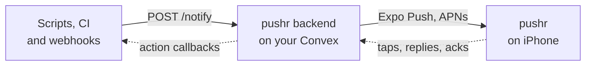

<div align="center">

<a href="https://pushr.sh">
  <picture>
    <source media="(prefers-color-scheme: dark)" srcset=".github/assets/pushr-dark.png">
    
  </picture>
</a>

<h1>pushr backend</h1>

<p><strong>Your phone, on the wire. On your own server.</strong><br>
The open-source Convex backend behind <a href="https://pushr.sh">pushr.sh</a>.<br>
Send a push to your iPhone from any script, server or bot with one HTTP request.</p>

<p>
  <a href="https://pushr.sh">Website</a> ·
  <a href="https://pushr.sh/docs">Docs</a> ·
  <a href="./API.md">API reference</a> ·
  <a href="https://pushr.sh/changelog">Changelog</a> ·
  <a href="https://pushr.sh/support">Support</a>
</p>

<p>
  
  
  
  
  
</p>

</div>

---

```bash
curl -X POST "$PUSHR_URL/notify" \
  -H "Authorization: Bearer $PUSHR_TOKEN" \
  -d '{"title":"Deploy succeeded","body":"main → production · 1m 04s"}'
```

That's the whole integration. Run this backend on your own Convex deployment, point the pushr iPhone app at
it, and every push lands in one calm feed, with no plans, quotas or limits.

## Why self-host

- **Your data stays yours.** Notifications, tokens and accounts live in a Convex deployment you own.
- **No quotas.** Unlimited pushes, source apps, sharing and history. Every Pro feature is on for every account.
- **One command to update.** Pull, then `bun run deploy`. Convex migrates the schema with the functions.
- **The same app.** Use the pushr app from the App Store. Settings → Server switches it to your deployment.

Prefer not to run anything? [pushr cloud](https://pushr.sh/pricing) is free to start.

## How it works



## Features

| Feature                 | What it does                                                                          |
| ----------------------- | ------------------------------------------------------------------------------------- |
| **One endpoint**        | `POST /notify` with a title and body. Priority, links, images and data are optional. |
| **Action buttons**      | Up to four per push: open a URL, call back your server, or take a typed reply.        |
| **Ack or escalate**     | Must-acknowledge pushes repeat until someone answers, even during quiet hours.        |
| **Interruption levels** | High priority and must-acknowledge pushes are time-sensitive, so they break through Focus. |
| **Scheduled delivery**  | `deliverAt` sends a push later.                                                       |
| **Safe retries**        | `Idempotency-Key` makes a retried request return the original push instead of a new one. |
| **Webhook adapters**    | GitHub, Sentry and Grafana, with signature checks, in one file each.                  |
| **Sharing**             | Invite people to a source app as viewers or editors.                                  |
| **Delivery tracking**   | Per-device status from Expo receipts, plus automatic cleanup of dead devices.          |
| **Accounts**            | Better Auth: email and password, password reset, email confirmation, Sign in with Apple. |

## Quickstart

You need [Bun](https://bun.sh), a free [Convex](https://convex.dev) account and the pushr app on an iPhone.

**1. Create your deployment.**

```bash
git clone https://github.com/cpreston321/pushr-backend && cd pushr-backend
bun install
bun run dev
```

The first run signs you in to Convex, creates a deployment and pushes the schema and functions. Leave it
running while you set up; it re-pushes on every change. Your URLs are written to `.env.local`.

**2. Set the two required secrets.**

```bash
bunx convex env set BETTER_AUTH_SECRET "$(openssl rand -hex 32)"
bunx convex env set SITE_URL "https://<your-deployment>.convex.site"
```

**3. Create your account.**

```bash
bunx convex run seed:createAdmin '{"email":"you@example.com","password":"<a strong password>"}'
```

**4. Connect the app.** In pushr, open **Settings → Server**, paste your `.convex.cloud` and `.convex.site`
URLs under **Custom Convex Deployment** and tap **Test connection**. Then make a connection code and type it in:

```bash
bunx convex run pairing:createCode    # → { "code": "P4QM-2B2V", "expiresInMinutes": 15 }
```

Tap **Save & sign out**. The app switches to your server right away; sign in with the account from step 3.
Codes prove you own the server: each one works once, for 15 minutes, and lets one new account sign up.
Invite someone else by sending them a fresh code.

**5. Send a push.** Create a source app in the **Apps** tab, copy its token (it's shown once), then:

```bash
export PUSHR_URL=https://<your-deployment>.convex.site PUSHR_TOKEN=pshr_…
curl -X POST "$PUSHR_URL/notify" -H "Authorization: Bearer $PUSHR_TOKEN" \
  -d '{"title":"Hello from my server","priority":"high"}'
```

<details>
<summary><strong>Optional settings</strong></summary>

<br>

Set these with `bunx convex env set NAME value`. The full list is in [`.env.example`](./.env.example).

| Variable                                         | What it does                                                                                      |
| ------------------------------------------------ | ------------------------------------------------------------------------------------------------- |
| `RESEND_API_KEY`, `EMAIL_FROM`                   | Sends password-reset and email-confirmation emails through [Resend](https://resend.com). Without them, emails are logged instead. |
| `EXPO_ACCESS_TOKEN`                              | Authenticates with Expo Push. Optional; unauthenticated works for personal use.                   |

</details>

## Send from anywhere

<table>
<tr><td><strong>curl</strong></td><td>

```bash
curl -X POST "$PUSHR_URL/notify" -H "Authorization: Bearer $PUSHR_TOKEN" \
  -d '{"title":"Backup done","body":"210 MB → s3://archive"}'
```

</td></tr>
<tr><td><strong>TypeScript</strong></td><td>

```ts
import { notify } from '@pushrsh/sdk'; // reads PUSHR_URL and PUSHR_TOKEN

await notify({
  title: 'Payment received',
  body: '$4,200.00 from Acme, Inc.',
  priority: 'high'
});
```

</td></tr>
<tr><td><strong>Shell</strong></td><td>

```bash
brew install cpreston321/tap/pushrsh
pushrsh "Cron failed" "$(tail -n 20 job.log)" -p high
```

</td></tr>
<tr><td><strong>Webhooks</strong></td><td>

```text
https://<your-deployment>.convex.site/hooks/github?token=$PUSHR_TOKEN
https://<your-deployment>.convex.site/hooks/sentry?token=$PUSHR_TOKEN
https://<your-deployment>.convex.site/hooks/grafana?token=$PUSHR_TOKEN
```

</td></tr>
</table>

Every field, status code and adapter is documented in **[API.md](./API.md)**.

## Updating

| When                                | Command          |
| ----------------------------------- | ---------------- |
| Developing (watch and push)         | `bun run dev`    |
| One-off push to your dev deployment | `bun run push`   |
| Push to your production deployment  | `bun run deploy` |

Convex pushes the schema and functions together, so there's no separate migration step. An incompatible
schema change fails the push and changes nothing. Dev and prod deployments don't share environment
variables, so set them on each.

## Differences from pushr cloud

- **Live Activities are cloud-only.** Starting and updating them needs the APNs key of the team that publishes
  the iPhone app. Everything else works the same.
- **No plans.** Pro features are on for every account on your deployment.
- **Delivery still goes through Expo Push,** like pushr cloud. Your deployment only needs outbound HTTPS.

## Project layout

```text
convex/
  http.ts            /notify, /hooks/*, /healthz
  notifyInternal.ts  validation, idempotency and the notification write
  expoPush.ts        delivery, chunking and per-device tracking
  ack.ts             ack-or-escalate
  hooks/             GitHub, Sentry and Grafana adapters
  betterAuth/        accounts and sign-in
  cleanup.ts         daily retention sweeps (crons.ts)
  schema.ts          every table and index
```

Adding a webhook provider is one file in `convex/hooks/` that turns the provider's payload into a notification.

## Security

Found a vulnerability? Email [support@pushr.sh](mailto:support@pushr.sh) instead of opening a public issue.
Source-app tokens and connection codes are stored as SHA-256 hashes, new accounts need a connection code from
the owner, action callbacks must be public `https` URLs, and webhook adapters verify provider signatures when a
secret is set.

## License

[MIT](./LICENSE) © Christian Preston. The pushr iPhone app is not open source.
